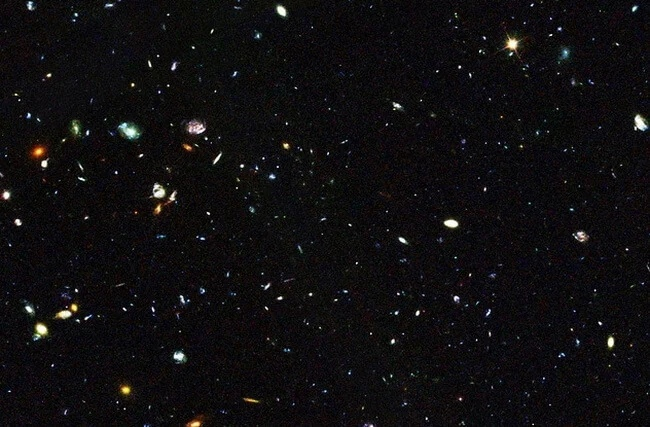

<!DOCTYPE html>
<html lang="ru">
    <head>
        <itle> Космос </itle>
        <meta charset="utf-8">
        <link rel="stylesheet" href="style.css">
    </head>
    <body>
        <header>
            <h1>7 Редчайших космических явлений:</h1>
        </header>
        <main>
            

                <h2>Сверхрассеянные галактики:</h2>
                

                    Каждая галактика является уникальной и каждая имеет собственные 
                    формы и размеры. И учёным удалось зафиксировать совершенно новый 
                    тип этих космических объектов: пушистые и дымчатые, как облака, 
                    сверхрассеянные галактики. Они содержат невероятно низкое количество 
                    звезд. Например, в недавно обнаруженной сверхрассеянной галактике 
                    протяженностью 60 тысяч световых лет (что примерно равно размеру 
                    нашего нашей галактики) содержится всего 1 процент звезд.
                    

                    В данный момент астрономами открыты 47 сверхрассеянных галактик. 
                    Они обладают настолько низким процентом содержащихся в них звезд, 
                    что ночное небо здесь казалось бы пустым.

                    Учёные всё ещё не знают точного происхождения таких галактик. 
                    Приоритетным вариантом является то, что сверхрассеянные галактики 
                    являются так называемыми несостоявшимися галактиками, у которых в 
                    момент их формирования закончился галактический материал 
                    (газ и пыль).
                

                
            

            

                <h2>Убийство астероида:</h2>
                

                    Ученые недавно стали свидетелями очень редкого космического 
                    явления — спонтанного разрушения астероида. Обычно к такому стечению 
                    обстоятельств приводят столкновения различных космических объектов. 
                    
                    Однако разрушение астероида P/2013 R3 под воздействием солнечного 
                    света оказалось для астрономов несколько неожиданным явлением. 
                    Нарастающее воздействие солнечного ветра привело к вращению R3. В 
                    какой-то момент это вращение достигло критической точки и разломило 
                    астероид на 10 крупных кусков весом около 200 000 тонн.
                

            

            

                <h2>Рождение звезды:</h2>
                

                    Ведя наблюдение за объектом W75N(B)-VLA2, астрономы стали свидетелями формирования нового небесного тела. Расположенный всего в 4200 световых лет от нас объект VLA2 был впервые обнаружен в 1996 году радиотелескопом VLA. Во время своего первого наблюдения ученые отметили плотное облако газа, испускаемое крошечной молодой звездой.
                    

В 2014 году при очередном наблюдении объекта W75N(B)-VLA2 ученые отметили явные изменения. За столь небольшой с астрономической точки зрения срок небесное тело изменилось, однако эти метаморфозы и не противоречили ранее созданным научно прогнозируемым моделям. За прошедшие 18 лет сферическая форма окружавшего звезду газа приобрела более вытянутую форму под воздействием накопленной пыли и космических обломков.
                

            

            

                <h2>Планета с невероятными температурными изменениями:</h2>
                

                    Космический объект «алмазная планета», почти полностью состоящий из кристаллического алмаза имеет необычную особенность. Учёные зафиксировали то, что разность температуры на планете может спонтанно меняться на 300 процентов, что просто невообразимо для планеты подобного типа.
                    

55 Cancri E является, пожалуй, самой необычной планетой внутри своей системы, состоящей из пяти других планет. Она невероятно плотная, а ее полный период оборота вокруг звезды занимает 18 часов. Под воздействием сильнейших приливных сил родной звезды планета обращена к ней только одной своей стороной. Так как температура на ней может изменяться от 1000 тысячи градусов до 2700 градусов Цельсия, ученые предполагают, что планета может быть покрыта вулканами.

Вулканическая гипотеза поддерживается доказательствами, обнаруженными в нашей собственной Солнечной системе. Спутник Юпитера Ио очень похож на описываемую планету, и приливные силы, направленные на этот спутник, превратили его в один сплошной гигантский вулкан.
                

            

            

                <h2>Тройное затмение:</h2>
                

                    Солнечные и лунные затмения — это действительно красивые явления. Но по части зрелищности тройное затмение на Юпитере их переигрывает.
                     В январе 2015 года были обнаружены три Галилеевых спутника — Ио, Европу и Каллисто, — выстроившихся в ряд перед своим «газовым папочкой» Юпитером.
                

            

            

                <h2>Столкновение метеора Персеиды с Луной:</h2>
                

                    9 августа 2008 года астрономы вперые увидели ударное падение метеоритов на наш естественный спутник. 
                    
                    Ввиду отсутствия у Луны атмосферы, падение метеоритов происходит довольно регулярно. Однако падение метеоров Персеиды, которые, в свою очередь, являются осколками медленно гибнущей кометы Свифта-Туттля, ознаменовалось особенно яркими вспышками на лунной поверхности.
Посмотреть все изображения
                

            

            

                <h2>Карликовые галактики, содержащие больше звезд, чем огромные галактики:</h2>
                

                    Астрономы проводили исследования, чтобы выяснить скорость формирования звезд в средних и крупных галактиках, однако о крошечных галактиках в этом вопросе до недавнего времени был пробел.
                    
После того как учёные получили инфракрасные данные о карликовых галактиках, за которыми велось наблюдение, астрономы были удивлены. Оказалось, что звездообразование в крошечных галактиках происходит гораздо быстрее, чем в более крупных галактиках. Удивляет это тем, что в более крупных галактиках содержится больше газа, который требуется для появления звезд. Ученые пока не знают, почему карликовые галактики оказываются настолько плодовитыми.
                

            

        </main>
        <footer>
            <h3>This incredible WWW page made by Yuriy, Evgeny and Serj</h3>
            <h3>literature: <a href="https://hi-news.ru/eto-interesno/10-ochen-redkix-kosmicheskix-yavlenij-svidetelyami-kotoryx-stali-astronomy.html/amp">hi-news</a></h3>
        </footer>
    </body>
</html>
